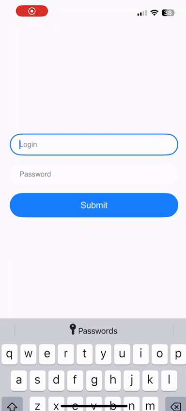

## About Me

I am a **Mobile Application Developer** with **15+ years of professional experience** building high-quality, scalable native and cross-platform iOS and Android applications.
This repository reflects my approach to designing **robust, testable, and scalable** mobile solutions using modern architectural patterns.

**Contact:**  
📧 Email: khasanrah@gmail.com  

**Available for hire:**  
💼 Upwork: https://www.upwork.com/freelancers/khasanr

---

## Project Overview – MoviesDemo (KMP – Jetpack Compose / SwiftUI)

This project demonstrates how to build **fully native iOS and Android applications** using **Kotlin Multiplatform Mobile (KMP)** for shared business logic, while keeping **UI 100% native** on each platform.

The project applies proven architectural patterns such as **MVVM**, **ViewModel-driven navigation**, **Domain-Driven Design (DDD)**, and **Dependency Injection (DI)**.

The demo shows how:
- Native iOS (Swift) and Android (Kotlin) apps can share **most of the business logic**
- UI layers remain **fully native** and platform-optimized
- **MVVM** can be applied consistently across platforms
- Navigation can be driven from **ViewModels**
- **Domain-Driven Design** structures the shared core
- Services remain fully abstract and injected via **DI**
- The architecture naturally supports **Unit Tests** and **Integration Tests**

The goal of this project is to demonstrate my experience in creating **beautiful**, **clear**, and **maintainable** mobile applications that can **scale to large, long-living products** without architectural bottlenecks.

### Other Implementations

- **MoviesDemo (KMP – Fragment / UIKit)**  
  https://github.com/xusan/movieskmpcompose
  
- **MoviesDemo (Swift – SwiftUI)**  
  https://github.com/devperson/MoviesSwift
  
- **MoviesDemo (.NET – Fragment / UIKit)**  
  https://github.com/devperson/MyDemoApp
  
> All *MoviesDemo* implementations have **identical domain models, architecture, and features**.
> The repositories differ only in **platform technology and UI framework**, demonstrating how the same
> core architecture can support multiple native UI approaches without changes to the business layer.
  
---

## Application Overview

This demo mobile application targets **iOS** and **Android** using:

- **Kotlin Multiplatform Mobile (KMP)** for shared code
- **Native Kotlin (Android)**
- **Native Swift (iOS)**

- ~**70% shared business logic (KMP)**
- ~**30% native UI code**
- Fully **native UI** on both platforms
- Clear separation between UI, ViewModels, Services, and Domain logic

---

## Application Features

- Fetches movies list from server
- Caches data in local storage
- Loads cached data on app restart
- Pull-to-refresh reloads data from server and updates cache
- Add new movie:
  - Name
  - Description
  - Photo (camera or gallery)
- Update movie
- Delete movie

---

## App Demo

| iOS | Android |
|-----|---------|
|  |  |

---

## Architecture Overview

High-level layering:

```
UI Layer (Swift / Kotlin)
        ↓
ViewModels (Shared via KMP)
        ↓
Service Layer (Shared via KMP)
        ↓
Domain Model (Shared via KMP)
        ↓
Infrastructure Services (Shared via KMP)
```

---

## UI Layer (Native, Declarative)

The UI layer is implemented using **modern declarative native frameworks** on each platform, while still following the **MVVM pattern** and keeping all business logic outside the UI.

Navigation is handled using **native declarative navigation APIs**, without introducing custom abstractions.

### Android
- Native **Jetpack Compose**
- Declarative UI
- MVVM pattern
- Navigation based on **NavHost / Navigation Compose**
- Lifecycle management aligned with **Compose lifecycle**

### iOS
- Native **SwiftUI**
- Declarative UI
- MVVM pattern
- Navigation based on **NavigationStack**
- Lifecycle management aligned with **SwiftUI view lifecycle**

UI responsibility:
- Rendering
- User interaction
- Navigation
- Binding to ViewModels

No business logic is implemented in the UI layer.

---

## 🧠 ViewModel Layer (Shared via KMP)

- Shared between iOS and Android using Kotlin Multiplatform
- Contains most application use-case logic
- Platform-agnostic
- Implements MVVM pattern
- Uses interfaces for platform-specific services
- Fully unit-tested

---

## 🔧 Service Layer (Shared via KMP)

The service layer is designed using **Domain-Driven Design** and common enterprise patterns such as **Facade** and **Decorator**.

All services are:
- Fully abstract
- Platform-independent
- Injected via **Dependency Injection**
- Implemented per platform only when required

### Contains:
- Domains
- Domain Services
- Application Services
- Infrastructure abstractions

---

## 🧪 Unit & Integration Testing

The project includes a comprehensive test suite:

1. **ViewModel Unit Tests**
   - Test shared use-case logic

2. **Application Services Unit Tests**
   - Validate business rules

3. **Infrastructure Unit Tests**
   - Test platform-specific implementations

4. **Integration Tests**
   - Use real services
   - Validate end-to-end behavior

---

## Dependencies (KMP)

### Shared (Kotlin Multiplatform)
- Kotlin Coroutines — Async operations
- Ktor — Networking
- Kotlinx Serialization — JSON serialization
- RealmDb — Multiplatform local storage

### Android
- Native Android SDK
- XML layouts

### iOS
- Native Swift
- UIKit and AsyncDisplayKit
- Swift Concurrency

---

## Why This Architecture?

This demo demonstrates how to build:
- Fully **native** mobile applications
- With **shared business logic via KMP**
- Clean separation of concerns
- High testability
- Long-term maintainability
- Scalability for enterprise-grade applications

---

## License

This project is provided for demonstration and educational purposes.
